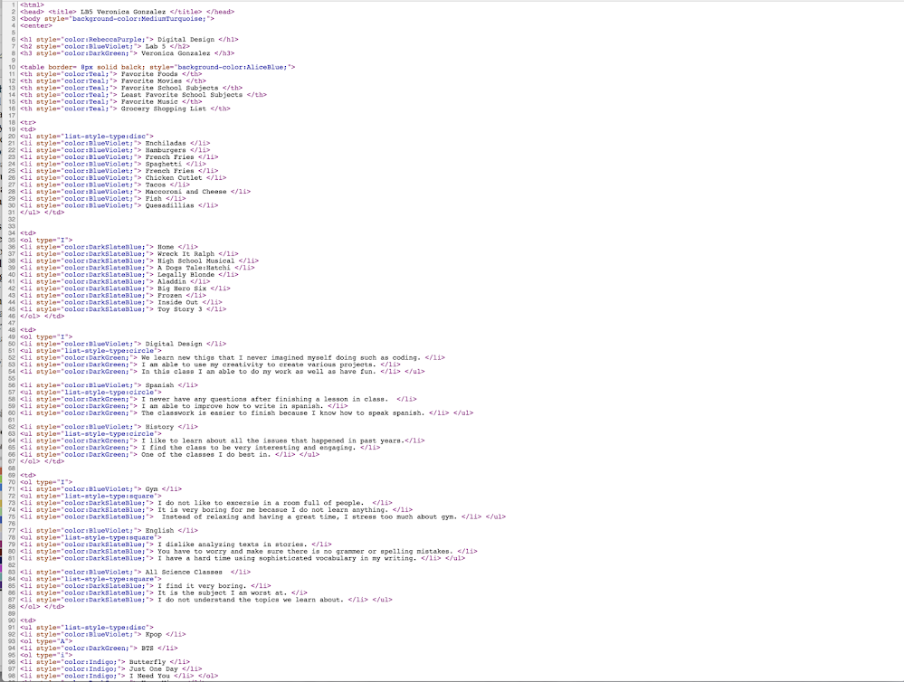
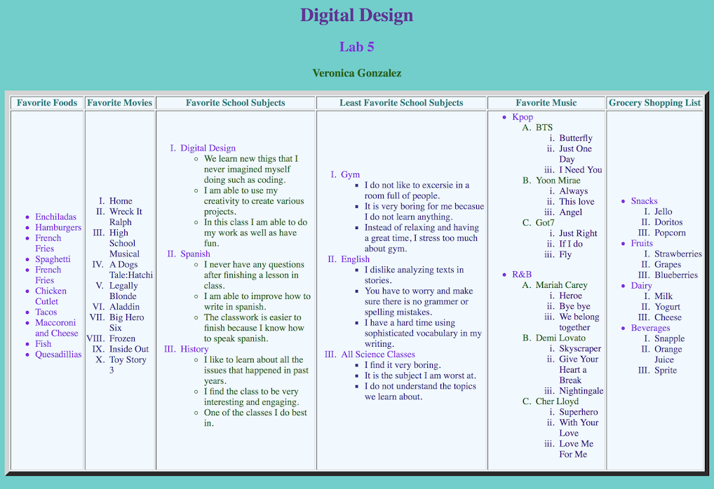
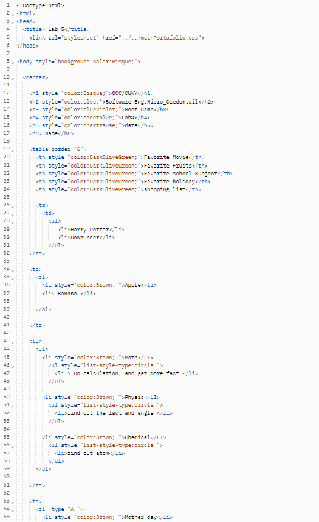
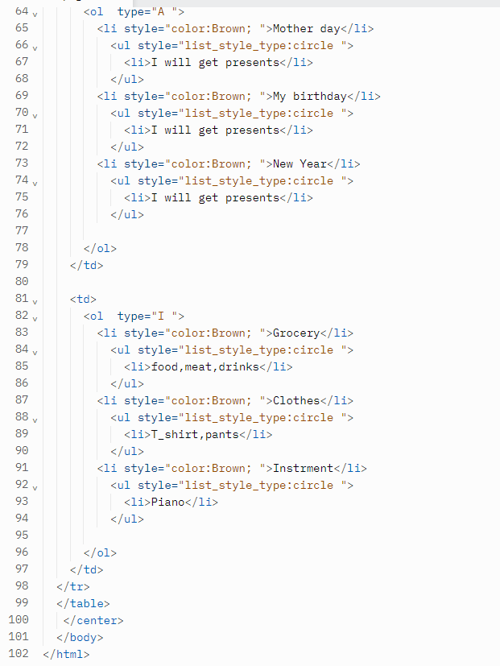

# Instructions  

  ** Lab 5
 
        In Lab 5, we incorporated the skills we used in our previous labs, especially lab number four. Lab 5 required us to create a table in which we create ordered and unordered lists. A ordered list is when you use numbers to put information  and you would use the tag <ol>. An unordered list is when you use bullet points to put in information and you would use the tag <ul>. For this lab we had to list our favorite foods, movies, favorite subjects, least favorite subjects, favorite music and a grocery shopping list. We had to list 10 of our favorite movies but by using an ordered list, 10 of our favorite foods by using an unordered list, 3 of our favorite subjects by using an unordered list, 3 of our least favorite subjects by using an ordered list (but our subs had to be unordered), two of our favorite music genres (when adding sub headings in order to list our favorite artists, we had to also use an unordered list), and we had to add a grocery shop list which had to be unordered (but the subs had to be ordered). Once we finished putting the information, we had to add color to our table and our text in order to make it look attractive. To get a good grade we had to use a variation of bullet points and numbers.**

  ## Steps
  1. 
  2. 
  3. 

  For example, 

  

    

  
  
  